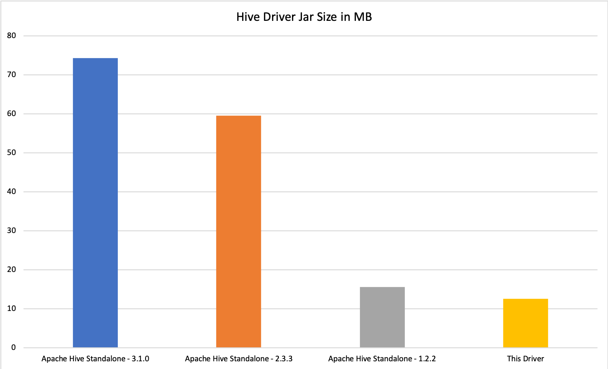

# Hive JDBC Driver

This project is alternative to the JDBC driver that is bundled with the Apache Hive project.  The desire to build this grew out of my experience maintaining the Hive JDBC "uber jar" project ([here](https://github.com/timveil/hive-jdbc-uber-jar)) which attempted to produce a smaller, more complete standalone driver jar by crafting an alternative Maven `pom` file.  While that effort mostly succeed in creating a slightly smaller jar, I felt like more could be done to improve the Hive JDBC experience.

As I started building out this project I realized that I wanted to deviate significantly from the existing Apache implementation.  As a result, this project does not desire or attempt to be URL or even feature compatible with the existing Apache Driver.  One obvious manifestation of this is that existing JDBC connection strings/URLs that work with the Apache Driver __WILL NOT WORK__ with this driver without modification.  I've provided a mapping for existing URL properties [here](DRIVER-PROPERTIES.md) as well as plenty of [examples](EXAMPLES.md). Another significant deviation is packaging.  In an effort to significantly trim jar sizes, I publish different flavors of the jar depending on connection type.  There is no one size fits all jar, instead the following flavors are produced:

- Binary: for `binary` connections without zookeeper discovery support
- Binary + Zookeeper: for `binary` connections that leverage zookeeper discovery
- HTTP: for `http` connections without zookeeper discovery support
- HTTP + Zookeeper: for `http` connections that leverage zookeeper discovery

The third significant deviation is the absence of Hadoop or Hive dependencies and their transitive dependency graphs.  The only bridge to Hive in this driver is the Thrift Interface Description Language (IDL) file.  All necessary code was rewritten from the ground up with an emphasis on eliminating external dependencies.  This, in combination with packaging, has the clear benefit of significantly reducing jar sizes.  For example if you are connecting to Hive running LLAP (Hive 2.x) using `binary` transport (the default) and not using Zookeeper discovery, the jar is 92% smaller than the original!

## Areas of Focus

The following are board areas where I have attempted expand or improve the existing Hive Driver:

* Jar size - focused on creating smaller, more portable jars
* Dependency graph - because JDBC drivers are often embedded in other applications it is important to limit the number of external dependencies that are shaded into the final jar.  Shaded dependencies are often the source of size bloat and classloader conflicts.  Every effort has been made to limit the number of external dependencies.
* Logging - logging inside hadoop dependencies and Hive is often a confusing mix of logging frameworks.  This driver works to provide clearer logging thru the standard SLF4J api.
* JDBC compatibility - it is doubtful that Hive will ever allow true JDBC spec compatibility... the underlying datastore simply doesn't yet (may never) provide many of the required concepts.  Having said that, there are plenty of methods and interfaces within the JDBC spec that have not been implemented by the Apache Driver that could have been.  I've attempted rectify that.
* Documentation - the existing Hive documentation can be difficult to follow.  For example, there doesn't seem to be a good single point of reference for all supported URL parameters.  Instead the complete picture of options must be gleaned from a handful of examples and sources.  This makes setting up connections difficult.
* Simplification - the existing driver supports concepts like "embedded mode" which adds complexity to connection logic and requires server side dependencies.  If you need "embedded mode", this driver is not for you.  
* External Configuration - in my experience you often need to add Java VM options (`-Dsome_config`) to get JDBC working.  This is especially prevalent when dealing with Kerberos.  This driver moves some of those common configuration flags and adds them as URL parameters.

